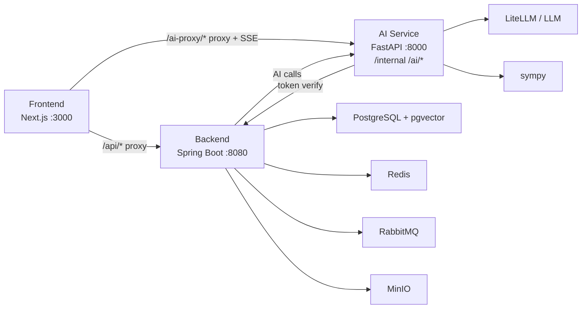

## 2026-06-09 Phase 2 架构收敛

- 前端主入口为 `/dashboard/agent`；`/dashboard` 和 `/dashboard/tutor` 均跳转到 `/dashboard/agent`。
- 浏览器 AI 聊天主链只走 `/ai-proxy/agent/chat/stream` -> AI Service `/ai/agent/chat/stream`。
- Java Backend 已移除学习专用 HTTP 面：`/api/tutor/*`、`/api/questions/*`、`/api/assessment/*`；`/api/sessions/*` 保留为 FamilyAgent 通用会话，新增默认 `source=FAMILY_AGENT`。
- Python AI Service 已移除 `/ai/tutor/*` 及题目讲解、出题、批改、错题复盘、每日练习、测评复习、学习计划工作流；保留 FamilyAgent、Mirror、记忆整理、成长守护和 embedding 主链。
- 历史数据库字段或 legacy 表可继续存在用于兼容和审计，但不再暴露为普通用户产品能力。
- 兼容性提醒：已移除的 legacy 路由当前包括 Backend `/api/tutor/*`、`/api/questions/*`、`/api/assessment/*` 与 AI `/ai/tutor/*`；外部调用方影响状态为“pending verification”。
- 稳定性发布要求：数据库 schema 在本地/预发统一由 backend Flyway 迁移管理；不再依赖手工 SQL migration 或启动时 schema auto-init。
- 稳定性发布要求：family lifecycle 启动检查默认只做审计日志，不做任何自动 family dissolve；显式 destructive flow 仅保留在用户删除等人工触发路径。
# 鎶€鏈灦鏋?
鏇存柊鏃堕棿锛?026-06-08

## 鎬讳綋鏋舵瀯



## 閰嶇疆褰掑睘

涓洪伩鍏嶁€滄牴鐩綍 `.env` 鏀逛竴娆″氨浼氬叏椤圭洰鐢熸晥鈥濈殑璇В锛屽綋鍓嶉噰鐢ㄦ寜鏈嶅姟鍒嗘不鐨勯厤缃柟寮忥細

| 浣嶇疆 | 浣滅敤鑼冨洿 |
|------|------|
| `/.env.infra.local` | 浠呯敤浜庢湰鍦板熀纭€璁炬柦閰嶇疆锛屼緵鏍圭洰褰?`docker compose` 浣跨敤锛岀鐞?PostgreSQL銆丷edis銆丷abbitMQ銆丮inIO 绛夊彉閲?|
| `/frontend/.env.local` | 浠呯敤浜庡墠绔厤缃紝渚嬪 `BACKEND_URL`銆乣AI_SERVICE_URL`銆乣NEXT_PUBLIC_*` |
| `/ai-service/.env` | 浠呯敤浜?AI 鏈嶅姟閰嶇疆锛屼緥濡傛ā鍨?key銆乣AUTH_FAIL_OPEN`銆丆ORS銆侀檺娴佷笌瓒呮椂 |
| `backend/src/main/resources/application-*.yml` | 鍚庣閰嶇疆鏉冨▉鍏ュ彛锛涘紑鍙戠幆澧冧互 Spring profile 鍜岄粯璁ゅ€间负涓伙紝涓嶅亣璁捐嚜鍔ㄨ鍙栨牴鐩綍 infra 閰嶇疆 |

鏈湴鍚姩鏍圭洰褰曞熀纭€璁炬柦鏃讹紝缁熶竴鏄惧紡浣跨敤锛?
```bash
docker compose --env-file .env.infra.local -f docker-compose.yml up -d
```

## 鏈嶅姟鑱岃矗

| 瀛愮郴缁?| 鑱岃矗 |
|--------|------|
| Frontend | 椤甸潰浜や簰銆佺櫥褰曟€併€佸搴┖闂淬€佹棩璁板綍鍏ャ€佺粡楠屽綍鍏ャ€佹垚闀垮畧鎶ゅ睍绀恒€侀暅鍍?Agent銆丼SE 灞曠ず銆佸浘琛ㄥ拰琛ㄥ崟 |
| Backend | 鐢ㄦ埛銆佸鏃忋€佹垚鍛樿鑹层€佽瑙掔О鍛笺€佺収鎶ゆ巿鏉冦€佸鏃忔棩璁般€佸鏃忕粡楠屻€佹垚闀胯褰曘€佹巿鏉冨彫鍥炪€侀搴撱€佹祴璇曡褰曘€佷細璇濄€佹寔涔呭寲 |
| AI Service | 瀹舵棌缁忛獙鏁寸悊銆佹垚闀挎彁閱掓憳瑕併€佹垚鍛樼敾鍍忚緟鍔┿€侀暅鍍忎笂涓嬫枃鏁寸悊銆佸搴櫔浼?/ 瀛︿範闄即銆佹暟瀛﹂獙璇併€丩LM 璋冪敤銆乪mbedding |

鍏抽敭鍘熷垯锛?
- Java Backend 鏄笟鍔℃暟鎹€佸搴潈闄愬拰杞祫浜ц褰曠殑鏉冨▉婧愩€?- Python AI Service 鏄?AI 鎺ㄧ悊銆佸唴瀹规暣鐞嗐€侀殣绉佽劚鏁忚緟鍔╁拰鍚戦噺鐢熸垚鏈嶅姟銆?- Frontend 鍙睍绀哄拰鎻愪氦锛屼笉鐩存帴鍐冲畾鐢ㄦ埛韬唤鎴栨潈闄愩€?- 瀹跺涵璁板繂銆佹垚鍛樼敾鍍忓拰鏈垚骞翠汉鏁版嵁杩涘叆 AI 鍓嶏紝蹇呴』鍏堢粡杩囧悗绔潈闄愯繃婊ゃ€?- 闀滃儚 Agent 涓婁笅鏂囧彧鑳戒娇鐢ㄥ凡鎺堟潈鏃ヨ銆佸凡鎺堟潈瀹舵棌缁忛獙鍜屽凡鎺堟潈闀滃儚鐢诲儚鎽樿銆?- 瑙嗚绉板懠鍙〃杈锯€滄垜鎬庝箞绉板懠 TA鈥濓紝涓嶈兘鐢ㄤ簬鎺ㄦ柇闅愮鏉冮檺銆?
## 璁よ瘉涓庤矾鐢?
| 璺敱 | 鐩爣 |
|------|------|
| `/api/*` | Next.js 浠ｇ悊鍒?Java Backend |
| `/ai-proxy/*` | 娴忚鍣ㄨ闂殑鍞竴 AI 鍏ュ彛锛岀敱 Next.js 浠ｇ悊鍒?AI Service `/ai/*` |
| `/ai/*` | AI Service 鍐呴儴璺敱锛屼笉浣滀负娴忚鍣ㄤ晶鍏紑鍏ュ彛 |
| `Authorization` | Sa-Token token锛屽墠绔繚瀛樺湪 localStorage |

Python AI Service 楠岃瘉 token 鏃惰皟鐢?Java `/api/users/me`銆?
寮€鍙戞湡鍙€氳繃 `AUTH_FAIL_OPEN=true` 淇濈暀 fail-open锛汢eta / 鐢熶骇蹇呴』 fail-closed銆傛祻瑙堝櫒涓嶇洿鎺ヤ緷璧?AI Service 鍏綉鍦板潃锛屾晱鎰熸帴鍙ｄ篃涓嶄俊浠诲墠绔紶鍏ョ殑瀹跺涵涓婁笅鏂囥€?
## 鏍稿績鏁版嵁娴?
### 瀹舵棌鏃ヨ

```text
Frontend -> Backend /api/diaries 鎻愪氦鏃ヨ/浜嬩欢/鑷垜澶嶇洏
Backend -> 鏍￠獙瀹跺涵鎴愬憳韬唤鍜屽彲瑙佽寖鍥?Backend -> 淇濆瓨 diary_entries
Backend -> 寮傛鐢熸垚 embedding
Frontend -> 鎸夋巿鏉冭寖鍥村睍绀烘棩璁板垪琛?AI/Mirror -> 鍙兘鍙洖鍚庣杩囨护鍚庣殑鎺堟潈鏃ヨ
```

### 瀹舵棌缁忛獙

```text
Frontend -> Backend /api/memories/family 鎻愪氦缁忛獙/鏁呬簨/鎻愰啋
Backend -> 鏍￠獙瀹跺涵鎴愬憳鏉冮檺鍜屽彲瑙佽寖鍥?Backend -> AI Service 鏁寸悊涓虹粡楠屽崱
AI Service -> 杩斿洖鏍囬銆佷富棰樸€侀闄╃偣銆佽鍔ㄥ缓璁?Backend -> 淇濆瓨缁忛獙鍗″拰鏉ユ簮淇℃伅
Backend -> 寮傛鐢熸垚 embedding
Frontend -> 灞曠ず缁欐巿鏉冩垚鍛?```

### 鎴愰暱瀹堟姢

```text
Frontend -> Backend 鎻愪氦鎴愬憳瑙傚療璁板綍
Backend -> 鏍￠獙鐓ф姢鎺堟潈鍏崇郴
Backend -> AI Service 鐢熸垚闈炶瘖鏂紡鎻愰啋鎽樿
AI Service -> 杩斿洖瓒嬪娍銆佸缓璁鍔ㄥ拰澶嶆煡鎻愮ず
Backend -> 淇濆瓨鎴愰暱璁板綍鍜屾彁閱?Frontend -> 瀹堕暱棣栭〉 / 鎴愬憳椤靛睍绀?```

### 闀滃儚 Agent

```text
Frontend -> Backend 閫夋嫨闀滃儚瀵硅薄鍜岄棶棰?Backend -> 鏍￠獙鍚屽搴€佸彲瑙佽寖鍥村拰鐓ф姢鎺堟潈
Backend -> 鍙洖鎺堟潈鏃ヨ銆佸鏃忕粡楠屽拰闀滃儚鐢诲儚鎽樿
Frontend/AI -> 浣跨敤鍚庣杩斿洖鐨勬巿鏉冧笂涓嬫枃鐢熸垚闀滃儚鍙傝€?AI Service -> 鏄庣‘鎻愮ず闈炴湰浜恒€侀潪鐪熷疄鎯虫硶銆佷粎鍩轰簬鎺堟潈璁板綍
Frontend -> 灞曠ず闀滃儚寮忓弬鑰冨洖绛斿拰涓嶇‘瀹氭€ф彁绀?```

### 瀹跺涵闄即 / 瀛︿範闄即

```text
Frontend -> Next.js /ai-proxy/agent/chat/stream
Next.js -> Backend /api/agent/chat/stream -> AI Service /ai/agent/chat/stream
Backend -> 杩囨护鍙繘鍏?AI 鐨勫搴笂涓嬫枃
AI Service -> LLM
AI Service -> SSE chunks
Frontend -> 娴佸紡灞曠ず
```

鏁板璇婃柇銆佹壒鏀广€侀敊棰樺拰瀛︿範鎶ュ憡褰撳墠鏄巻鍙插吋瀹瑰拰鎴愰暱淇″彿鏉ユ簮锛屼笉鍐嶆槸浜у搧鎴樼暐涓荤嚎銆?
## 涓昏鍚庣鎺ュ彛

| 鑳藉姏 | 鎺ュ彛 |
|------|------|
| 褰撳墠鐢ㄦ埛 | `GET /api/users/me` |
| 鐧诲綍 | `POST /api/users/login` |
| 娉ㄥ唽 | `POST /api/users/register` |
| 鎴戠殑瀹跺涵 | `GET /api/families/my` |
| 瀹跺涵鎴愬憳 | `GET /api/families/{familyId}/members` |
| 鏇存柊鎴愬憳瑙掕壊 | `PUT /api/families/{familyId}/members/{userId}/role` |
| 鎴戠殑鎴愬憳绉板懠 | `GET /api/families/{familyId}/relationships/my-labels` |
| 璁剧疆鎴愬憳绉板懠 | `PUT /api/families/{familyId}/members/{targetUserId}/relationship` |
| 鎴戠殑鐓ф姢鎺堟潈 | `GET /api/families/{familyId}/care-authorizations/my` |
| 璁剧疆鐓ф姢鎺堟潈 | `PUT /api/families/{familyId}/members/{subjectUserId}/caregivers/{caregiverUserId}` |
| 瀹舵棌鏃ヨ鍒楄〃 | `GET /api/diaries/family/{familyId}` |
| 鍒涘缓瀹舵棌鏃ヨ | `POST /api/diaries` |
| 鍒犻櫎 / 褰掓。瀹舵棌鏃ヨ | `DELETE /api/diaries/{id}` |
| 瀹舵棌缁忛獙鍒楄〃 | `GET /api/memories/family/{familyId}` |
| 鍒涘缓瀹舵棌缁忛獙 | `POST /api/memories/family` |
| 瀹舵棌缁忛獙鍚戦噺閲嶅缓 | `POST /api/memories/family/{familyId}/embeddings/rebuild` |
| 鎴愰暱瀹堟姢璁板綍 | `GET /api/growth-guards/family/{familyId}` |
| 鍒涘缓鎴愰暱瑙傚療 | `POST /api/growth-guards` |
| 鎴愰暱瀹堟姢鍛ㄦ姤 | `GET /api/growth-guards/reports/family/{familyId}` |
| 鍒涘缓鎴愰暱瀹堟姢鍛ㄦ姤 | `POST /api/growth-guards/reports` |
| 闀滃儚鎺堟潈涓婁笅鏂?| `GET /api/mirror/families/{familyId}/members/{targetUserId}/context` |

Beta 鍓嶅缓璁ˉ榻愶細

| 鑳藉姏 | 鎺ュ彛 |
|------|------|
| 鏇存柊鏃ヨ / 缁忛獙鍙鑼冨洿 | `PUT /api/diaries/{id}/visibility` / `PUT /api/memories/{id}/visibility` |
| 瀹堕暱棣栭〉鎽樿 | `GET /api/families/{familyId}/guardian-dashboard` |
| 瀹舵棌杞祫浜у懆鎶?| `GET /api/families/{familyId}/heritage-weekly-report` |
| 鎴愬憳鐢诲儚閲嶅缓 | `POST /api/families/{familyId}/members/{userId}/profile/rebuild` |
| 闀滃儚瀵硅瘽涓撶敤鎺ュ彛 | `POST /api/mirror/chat` |

## 涓昏 AI 鎺ュ彛

| 鑳藉姏 | 鎺ュ彛 |
|------|------|
| 鍋ュ悍妫€鏌?| 娴忚鍣?`GET /ai-proxy/health` -> AI Service `GET /ai/health` |
| 缁忛獙鎶藉彇 | 娴忚鍣?`POST /ai-proxy/memory/extract` -> AI Service `POST /ai/memory/extract` |
| 缁忛獙鍗℃暣鐞?| 娴忚鍣?`POST /ai-proxy/memory/family-card` -> AI Service `POST /ai/memory/family-card` |
| 鎴愰暱瀹堟姢鍛ㄦ姤 | 娴忚鍣?`POST /ai-proxy/growth/weekly-report` -> AI Service `POST /ai/growth/weekly-report` |
| Embedding 鐢熸垚 | Backend / 鍐呴儴 `POST /ai/embedding/embed` |
| FamilyAgent 瀵硅瘽 SSE | 娴忚鍣?`POST /ai-proxy/agent/chat/stream` -> Backend `POST /api/agent/chat/stream` -> AI Service `POST /ai/agent/chat/stream` |

## 鏍稿績琛?
| 琛?| 鐢ㄩ€?|
|----|------|
| `users` | 鐢ㄦ埛 |
| `families` | 瀹舵棌 |
| `family_members` | 瀹舵棌鎴愬憳鍜岃蒋浠舵潈闄愯鑹?|
| `family_relationships` | 褰撳墠鐢ㄦ埛瑙嗚涓嬬殑浜插睘绉板懠杈癸紝涓嶅弬涓庢潈闄愬垽鏂?|
| `care_authorizations` | 鐓ф姢鎺堟潈杈?|
| `invite_codes` | 閭€璇风爜 |
| `diary_entries` | 瀹舵棌鏃ヨ銆佷簨浠惰褰曘€佽嚜鎴戝鐩樺拰缁欏浜虹殑璇?|
| `family_memories` / `memory_entries` | 瀹舵棌缁忛獙銆佹晠浜嬨€佹彁閱掑拰寤鸿 |
| `memory_embeddings` | 鏃ヨ銆佺粡楠屽拰鎴愰暱瑙傚療鐨勫悜閲忕储寮?|
| `growth_guard_records` | 鎴愰暱瀹堟姢瑙傚療璁板綍 |
| `growth_guard_reports` / `growth_guard_alerts` | 闈炶瘖鏂紡鎻愰啋銆佸懆鎶ュ拰寰呰窡杩涗簨椤?|
| `mirror_agent_data` | 闀滃儚鐢诲儚鎽樿锛岃繘鍏?AI 涓婁笅鏂囧墠蹇呴』鎸夋潈闄愯繃婊?|
| `member_profiles` | 鎺堟潈鑼冨洿鍐呯殑鎴愬憳鐢诲儚鎽樿 |
| `heritage_tasks` | 瀹舵棌缁忛獙娌夋穩鍚庣殑瀹炶返浠诲姟 |
| `chat_sessions` | 璁查 / 闄即浼氳瘽 |
| `knowledge_points`銆乣questions`銆乣test_records`銆乣wrong_question_records`銆乣ability_profiles` | 鍘嗗彶鏁欒偛妯″潡 |

## 闀挎湡璁板繂鍒嗗眰

| 灞傜骇 | 鍚嶇О | 涓昏鏁版嵁 | 鏉冨▉鏈嶅姟 |
|------|------|----------|----------|
| L0 | 鍘熷璁板綍灞?| 鏃ヨ銆佸鏃忕粡楠屻€佹垚闀胯褰曘€佷細璇?| Backend |
| L1 | 缁撴瀯鍖栨憳瑕佸眰 | 缁忛獙鍗°€佹垚闀胯瀵?metadata銆佸懆鎶ユ憳瑕?| Backend + AI Service |
| L2 | 鍚戦噺绱㈠紩灞?| `memory_embeddings` | Backend + AI Service |
| L3 | 鎴愬憳鐢诲儚灞?| `member_profiles`銆乣mirror_agent_data` | Backend + AI Service |
| L4 | 浼氳瘽宸ヤ綔璁板繂灞?| 褰撳墠浼氳瘽鍒氫繚瀛樼殑璁板繂鍜?SSE metadata | Frontend + AI Service |

AI 鍙互涓诲姩鍙戠幇鍊煎緱娌夋穩鐨勫唴瀹癸紝浣嗗啓鍏ラ暱鏈熻蹇嗗墠蹇呴』鐢辩敤鎴锋槑纭‘璁わ紝闄ら潪鐢ㄦ埛宸茬粡鏄庣‘鍙戝嚭鈥滀繚瀛?/ 璁颁笅鏉モ€濈瓑鎸囦护銆?
## Agent 杈圭晫

涓嶅彲鍗忓晢锛?
- FamilyAgent 鏄鏃忔暀鑲蹭笌闄即 Agent锛屼笉鏄湇浠庡瀷瑙掕壊鎴栨棤闄愬埗鑱婂ぉ浜烘牸銆?- 鏁板瀹舵暀浼樺厛甯姪瀛︾敓鐞嗚В鏂规硶锛屼笉鑳介暱鏈熸浛浠ｅ鐢熸€濊€冦€?- 涓嶈兘缇炶颈銆佸▉鑳併€佹搷鎺с€佽船浣庡瀛愶紝涔熶笉鑳介紦鍔卞闀跨敤姣旇緝寮忚瑷€鎺у埗瀛╁瓙銆?- 闀滃儚 Agent 鍙兘鍋氬熀浜庢巿鏉冭祫鏂欑殑椋庢牸鍙傝€冿紝涓嶈兘鍋囪鏈汉銆佷吉閫犺蹇嗘垨鍒堕€犵‘瀹氭€т汉鏍肩粨璁恒€?- 瀹跺涵缁忛獙蹇呴』淇濈暀鏉ユ簮銆佺被鍨嬨€佺疆淇″害鍜屽鏍哥姸鎬侊紝涓嶈兘鎶婁竴娆″璇濈洿鎺ュ崌鏍间负瀹跺涵鍘熷垯銆?
鍙€傞厤锛?
- 琛ㄨ揪璇皵銆佹暀瀛﹁妭濂忋€佸搴亸濂姐€佸瀛愮敾鍍忓拰褰撳墠浠诲姟鐩爣銆?
## 鏋舵瀯浼樺寲浼樺厛绾?
P0锛?
- AI Service 鐢熶骇 fail-closed銆?- 缁熶竴鍓嶇 AI 鍏ュ彛涓?`/ai-proxy/*`銆?- 鏀剁揣 AI Service CORS銆?- 鏁忔劅涓婁笅鏂囨嫾瑁呭悗绉诲埌 Backend銆?- AI Service 涓嶇洿鎺ヤ俊浠诲墠绔紶鍏ョ殑瀹跺涵涓婁笅鏂囥€?
P1锛?
- 寮曞叆 Flyway 鎴?Liquibase锛屾浛浠ｅ垎鏁?schema initializer銆?- embedding銆乻killrun銆侀暱鑰楁椂 AI 浠诲姟闃熷垪鍖栥€?- 鎷嗗垎 `frontend/src/lib/api.ts` 鍜?`frontend/src/hooks/useChat.ts`銆?- 鏄庣‘鏂颁富绾挎ā鍧楀拰鍘嗗彶鏁欒偛妯″潡杈圭晫銆?- 鍚庣 `AIServiceClient` 鎴愪负鍞竴 AI outbound gateway銆?
P2锛?
- 寤虹珛鏈€灏?CI 鍩虹嚎銆?- 澧炲姞缁熶竴鍙娴嬫€с€乼race id 鍜?AI 璋冪敤瀹¤銆?- 鏄庣‘ RabbitMQ 鍜?MinIO 鐨勭涓€钀藉湴鐐广€?- 缁熶竴瀹夊叏鍝嶅簲澶淬€侀敊璇搷搴旀牸寮忓拰鏁忔劅淇℃伅鏃ュ織绛栫暐銆?
## 褰撳墠绾︽潫

- RabbitMQ 宸查厤缃絾褰撳墠涓婚摼璺湭瀹屽叏鍚敤銆?- MinIO 宸查厤缃紝鏈潵鐢ㄤ簬璇煶銆佺収鐗囥€佷綔鍝佸拰瀹跺涵绱犳潗銆?- schema 宸叉敹鏁涗负 Flyway baseline + versioned migrations 锛屼笉鍐嶄娇鐢?`scripts/init-db.sql` 鎴?Java initializer 鍙屾簮妯″紡銆?- 鍓嶇娴嬭瘯瑕嗙洊浠嶄笉瓒炽€?- 鍏綉 Beta 鍓嶉渶瑕佹垚鏈帶鍒躲€佷娇鐢ㄦ棩蹇椼€侀殣绉佹彁绀哄拰鎺堟潈杈圭晫銆?- 鎴愰暱瀹堟姢涓嶈兘杈撳嚭鍖荤枟璇婃柇锛屽彧鑳借緭鍑烘彁閱掋€佽褰曘€佺鏅拰灏卞尰寤鸿銆?

## 2026-06-10 AI 对话自动保存回归清单

- 首轮建会话：新建空会话发送 1 轮消息，确认只创建 1 个 `chat_sessions` 头，并追加 1 条 user + 1 条 assistant。
- 连续多轮：连续快速发送 3-5 轮，确认同一 `session_id` 下 `chat_session_messages.seq` 严格递增，且每轮 user 在前、assistant 在后。
- 停止流式：assistant 已生成非空文本时点击停止，确认最终文本被保存；assistant 为空时点击停止，确认不会落空 assistant 消息。
- 错误返回：模拟 AI 请求失败，确认页面显示错误文本，且错误文本仍按 1 条 assistant message 追加保存。
- 切换会话：在流式过程中切到另一条历史会话，再切回，确认旧异步结果不会覆盖当前 UI，也不会落到错误 session。
- 恢复历史后继续聊：进入旧会话继续发送，确认消息追加到原 `sessionId`，不会新建第二个会话头。
- 删除当前会话：删除当前活跃会话后再次发送，确认后续消息只会写入新的有效 session。
- 切换家庭：切换 `activeFamilyId` 后发送新消息，确认旧家庭的异步返回不会污染当前会话和会话列表。
- 浏览器联调时同时观察：历史会话列表、当前对话区、`chat_sessions.message_count/last_message_at`、`chat_session_messages.session_id/seq/role/content`。

## 2026-06-10 双环境部署

- 正式环境固定部署在云服务器，正式域名 `app.familyagent.cn` 只回源到云服务器上的 Frontend `:3000`。
- 本地开发环境继续使用 `localhost`，不再承担正式公网访问；本地与正式环境的数据库、Redis、RabbitMQ、MinIO 和密钥完全隔离。
- 云服务器运行采用 `systemd + Cloudflare named tunnel + GitHub Actions SSH 自动部署`。
- 生产 systemd 单元模板位于 `deploy/systemd/`，安装脚本为 `scripts/install-systemd-services.sh`，部署脚本为 `scripts/deploy-prod.sh`。
- 生产配置统一放在 `/etc/familyagent/`，仓库内仅保留 `deploy/env/*.example` 和 `deploy/cloudflared/config.yml.example` 作为模板。
- 自动部署只监听 `main` 分支；部署顺序固定为 `infra -> ai -> backend -> frontend -> tunnel`，完成后健康检查 `3000 / 8180 / 8090`。
## 2026-06-10 数据库迁移真相源更新

- `backend/src/main/resources/db/migration` 是唯一 schema 真相源。
- Backend 通过 Flyway 管理本地与预发 schema，不再依赖 Java `SchemaInitializer` 或根目录 `scripts/*.sql`。
- `spring.flyway.baseline-on-migrate=true` 用于兼容已有非空库：
  - 空库执行 `V1` 基线和后续迁移
  - 已有库先 baseline，再执行收口迁移
- Legacy 学习链路已退出主 schema：
  - 删除 `knowledge_points`、`questions`、`test_records`、`wrong_question_records`、`ability_profiles`
  - 删除 `chat_sessions.question_id`、`chat_sessions.knowledge_point_id`、`memory_entries.knowledge_point_id`
- 本地启动链路只负责启动 PostgreSQL，schema 建立与升级由 backend 启动时的 Flyway 自动完成。
