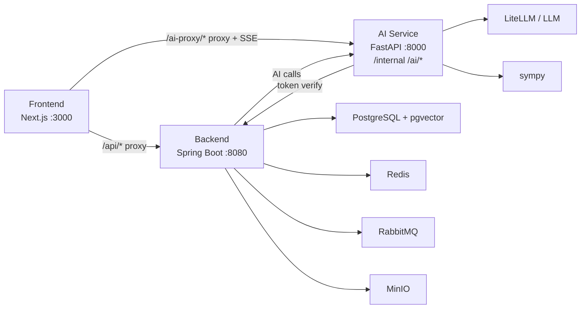

# 技术架构

更新时间：2026-06-08

## 总体架构



## 配置归属

为避免“根目录 `.env` 改一次就会全项目生效”的误解，当前采用按服务分治的配置方式：

| 位置 | 作用范围 |
|------|------|
| `/.env.infra.local` | 仅用于本地基础设施配置，供根目录 `docker compose` 使用，管理 PostgreSQL、Redis、RabbitMQ、MinIO 等变量 |
| `/frontend/.env.local` | 仅用于前端配置，例如 `BACKEND_URL`、`AI_SERVICE_URL`、`NEXT_PUBLIC_*` |
| `/ai-service/.env` | 仅用于 AI 服务配置，例如模型 key、`AUTH_FAIL_OPEN`、CORS、限流与超时 |
| `backend/src/main/resources/application-*.yml` | 后端配置权威入口；开发环境以 Spring profile 和默认值为主，不假设自动读取根目录 infra 配置 |

本地启动根目录基础设施时，统一显式使用：

```bash
docker compose --env-file .env.infra.local -f docker-compose.yml up -d
```

## 服务职责

| 子系统 | 职责 |
|--------|------|
| Frontend | 页面交互、登录态、家庭空间、日记录入、经验录入、成长守护展示、镜像 Agent、SSE 展示、图表和表单 |
| Backend | 用户、家族、成员角色、视角称呼、照护授权、家族日记、家族经验、成长记录、授权召回、题库、测试记录、会话、持久化 |
| AI Service | 家族经验整理、成长提醒摘要、成员画像辅助、镜像上下文整理、家庭陪伴 / 学习陪伴、数学验证、LLM 调用、embedding |

关键原则：

- Java Backend 是业务数据、家庭权限和软资产记录的权威源。
- Python AI Service 是 AI 推理、内容整理、隐私脱敏辅助和向量生成服务。
- Frontend 只展示和提交，不直接决定用户身份或权限。
- 家庭记忆、成员画像和未成年人数据进入 AI 前，必须先经过后端权限过滤。
- 镜像 Agent 上下文只能使用已授权日记、已授权家族经验和已授权镜像画像摘要。
- 视角称呼只表达“我怎么称呼 TA”，不能用于推断隐私权限。

## 认证与路由

| 路由 | 目标 |
|------|------|
| `/api/*` | Next.js 代理到 Java Backend |
| `/ai-proxy/*` | 浏览器访问的唯一 AI 入口，由 Next.js 代理到 AI Service `/ai/*` |
| `/ai/*` | AI Service 内部路由，不作为浏览器侧公开入口 |
| `Authorization` | Sa-Token token，前端保存在 localStorage |

Python AI Service 验证 token 时调用 Java `/api/users/me`。

开发期可通过 `AUTH_FAIL_OPEN=true` 保留 fail-open；Beta / 生产必须 fail-closed。浏览器不直接依赖 AI Service 公网地址，敏感接口也不信任前端传入的家庭上下文。

## 核心数据流

### 家族日记

```text
Frontend -> Backend /api/diaries 提交日记/事件/自我复盘
Backend -> 校验家庭成员身份和可见范围
Backend -> 保存 diary_entries
Backend -> 异步生成 embedding
Frontend -> 按授权范围展示日记列表
AI/Mirror -> 只能召回后端过滤后的授权日记
```

### 家族经验

```text
Frontend -> Backend /api/memories/family 提交经验/故事/提醒
Backend -> 校验家庭成员权限和可见范围
Backend -> AI Service 整理为经验卡
AI Service -> 返回标题、主题、风险点、行动建议
Backend -> 保存经验卡和来源信息
Backend -> 异步生成 embedding
Frontend -> 展示给授权成员
```

### 成长守护

```text
Frontend -> Backend 提交成员观察记录
Backend -> 校验照护授权关系
Backend -> AI Service 生成非诊断式提醒摘要
AI Service -> 返回趋势、建议行动和复查提示
Backend -> 保存成长记录和提醒
Frontend -> 家长首页 / 成员页展示
```

### 镜像 Agent

```text
Frontend -> Backend 选择镜像对象和问题
Backend -> 校验同家庭、可见范围和照护授权
Backend -> 召回授权日记、家族经验和镜像画像摘要
Frontend/AI -> 使用后端返回的授权上下文生成镜像参考
AI Service -> 明确提示非本人、非真实想法、仅基于授权记录
Frontend -> 展示镜像式参考回答和不确定性提示
```

### 家庭陪伴 / 学习陪伴

```text
Frontend -> Next.js /ai-proxy/agent/chat/stream
Next.js -> Backend /api/agent/chat/stream -> AI Service /ai/agent/chat/stream
Backend -> 过滤可进入 AI 的家庭上下文
AI Service -> LLM
AI Service -> SSE chunks
Frontend -> 流式展示
```

数学诊断、批改、错题和学习报告当前是历史兼容和成长信号来源，不再是产品战略主线。

## 主要后端接口

| 能力 | 接口 |
|------|------|
| 当前用户 | `GET /api/users/me` |
| 登录 | `POST /api/users/login` |
| 注册 | `POST /api/users/register` |
| 我的家庭 | `GET /api/families/my` |
| 家庭成员 | `GET /api/families/{familyId}/members` |
| 更新成员角色 | `PUT /api/families/{familyId}/members/{userId}/role` |
| 我的成员称呼 | `GET /api/families/{familyId}/relationships/my-labels` |
| 设置成员称呼 | `PUT /api/families/{familyId}/members/{targetUserId}/relationship` |
| 我的照护授权 | `GET /api/families/{familyId}/care-authorizations/my` |
| 设置照护授权 | `PUT /api/families/{familyId}/members/{subjectUserId}/caregivers/{caregiverUserId}` |
| 家族日记列表 | `GET /api/diaries/family/{familyId}` |
| 创建家族日记 | `POST /api/diaries` |
| 删除 / 归档家族日记 | `DELETE /api/diaries/{id}` |
| 家族经验列表 | `GET /api/memories/family/{familyId}` |
| 创建家族经验 | `POST /api/memories/family` |
| 家族经验向量重建 | `POST /api/memories/family/{familyId}/embeddings/rebuild` |
| 成长守护记录 | `GET /api/growth-guards/family/{familyId}` |
| 创建成长观察 | `POST /api/growth-guards` |
| 成长守护周报 | `GET /api/growth-guards/reports/family/{familyId}` |
| 创建成长守护周报 | `POST /api/growth-guards/reports` |
| 镜像授权上下文 | `GET /api/mirror/families/{familyId}/members/{targetUserId}/context` |

Beta 前建议补齐：

| 能力 | 接口 |
|------|------|
| 更新日记 / 经验可见范围 | `PUT /api/diaries/{id}/visibility` / `PUT /api/memories/{id}/visibility` |
| 家长首页摘要 | `GET /api/families/{familyId}/guardian-dashboard` |
| 家族软资产周报 | `GET /api/families/{familyId}/heritage-weekly-report` |
| 成员画像重建 | `POST /api/families/{familyId}/members/{userId}/profile/rebuild` |
| 镜像对话专用接口 | `POST /api/mirror/chat` |

## 主要 AI 接口

| 能力 | 接口 |
|------|------|
| 健康检查 | 浏览器 `GET /ai-proxy/health` -> AI Service `GET /ai/health` |
| 经验抽取 | 浏览器 `POST /ai-proxy/memory/extract` -> AI Service `POST /ai/memory/extract` |
| 经验卡整理 | 浏览器 `POST /ai-proxy/memory/family-card` -> AI Service `POST /ai/memory/family-card` |
| 成长守护周报 | 浏览器 `POST /ai-proxy/growth/weekly-report` -> AI Service `POST /ai/growth/weekly-report` |
| Embedding 生成 | Backend / 内部 `POST /ai/embedding/embed` |
| FamilyAgent 对话 SSE | 浏览器 `POST /ai-proxy/agent/chat/stream` -> Backend `POST /api/agent/chat/stream` -> AI Service `POST /ai/agent/chat/stream` |

## 核心表

| 表 | 用途 |
|----|------|
| `users` | 用户 |
| `families` | 家族 |
| `family_members` | 家族成员和软件权限角色 |
| `family_relationships` | 当前用户视角下的亲属称呼边，不参与权限判断 |
| `care_authorizations` | 照护授权边 |
| `invite_codes` | 邀请码 |
| `diary_entries` | 家族日记、事件记录、自我复盘和给家人的话 |
| `family_memories` / `memory_entries` | 家族经验、故事、提醒和建议 |
| `memory_embeddings` | 日记、经验和成长观察的向量索引 |
| `growth_guard_records` | 成长守护观察记录 |
| `growth_guard_reports` / `growth_guard_alerts` | 非诊断式提醒、周报和待跟进事项 |
| `mirror_agent_data` | 镜像画像摘要，进入 AI 上下文前必须按权限过滤 |
| `member_profiles` | 授权范围内的成员画像摘要 |
| `heritage_tasks` | 家族经验沉淀后的实践任务 |
| `chat_sessions` | 讲题 / 陪伴会话 |
| `knowledge_points`、`questions`、`test_records`、`wrong_question_records`、`ability_profiles` | 历史教育模块 |

## 长期记忆分层

| 层级 | 名称 | 主要数据 | 权威服务 |
|------|------|----------|----------|
| L0 | 原始记录层 | 日记、家族经验、成长记录、会话 | Backend |
| L1 | 结构化摘要层 | 经验卡、成长观察 metadata、周报摘要 | Backend + AI Service |
| L2 | 向量索引层 | `memory_embeddings` | Backend + AI Service |
| L3 | 成员画像层 | `member_profiles`、`mirror_agent_data` | Backend + AI Service |
| L4 | 会话工作记忆层 | 当前会话刚保存的记忆和 SSE metadata | Frontend + AI Service |

AI 可以主动发现值得沉淀的内容，但写入长期记忆前必须由用户明确确认，除非用户已经明确发出“保存 / 记下来”等指令。

## Agent 边界

不可协商：

- FamilyAgent 是家族教育与陪伴 Agent，不是服从型角色或无限制聊天人格。
- 数学家教优先帮助学生理解方法，不能长期替代学生思考。
- 不能羞辱、威胁、操控、贬低孩子，也不能鼓励家长用比较式语言控制孩子。
- 镜像 Agent 只能做基于授权资料的风格参考，不能假装本人、伪造记忆或制造确定性人格结论。
- 家庭经验必须保留来源、类型、置信度和复核状态，不能把一次对话直接升格为家庭原则。

可适配：

- 表达语气、教学节奏、家庭偏好、孩子画像和当前任务目标。

## 架构优化优先级

P0：

- AI Service 生产 fail-closed。
- 统一前端 AI 入口为 `/ai-proxy/*`。
- 收紧 AI Service CORS。
- 敏感上下文拼装后移到 Backend。
- AI Service 不直接信任前端传入的家庭上下文。

P1：

- 引入 Flyway 或 Liquibase，替代分散 schema initializer。
- embedding、skillrun、长耗时 AI 任务队列化。
- 拆分 `frontend/src/lib/api.ts` 和 `frontend/src/hooks/useChat.ts`。
- 明确新主线模块和历史教育模块边界。
- 后端 `AIServiceClient` 成为唯一 AI outbound gateway。

P2：

- 建立最小 CI 基线。
- 增加统一可观测性、trace id 和 AI 调用审计。
- 明确 RabbitMQ 和 MinIO 的第一落地点。
- 统一安全响应头、错误响应格式和敏感信息日志策略。

## 当前约束

- RabbitMQ 已配置但当前主链路未完全启用。
- MinIO 已配置，未来用于语音、照片、作品和家庭素材。
- schema 当前仍有 `scripts/init-db.sql` 和 Java initializer 两层来源，长期应迁移到版本化迁移。
- 前端测试覆盖仍不足。
- 公网 Beta 前需要成本控制、使用日志、隐私提示和授权边界。
- 成长守护不能输出医疗诊断，只能输出提醒、记录、科普和就医建议。
