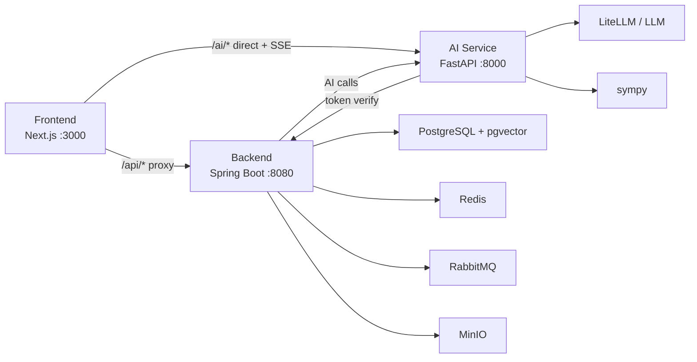

# 系统架构与接口契约

## 总体架构



## 服务职责

| 子系统 | 职责 |
|--------|------|
| Frontend | 页面交互、登录态、家庭空间、日记录入、经验录入、成长守护展示、镜像 Agent、SSE 展示、图表和表单 |
| Backend | 用户、家族、成员角色、视角称呼、照护授权、家族日记、家族经验、成长记录、授权召回、题库、测试记录、会话、持久化 |
| AI Service | 家族经验整理、成长提醒摘要、成员画像辅助、镜像上下文整理、家庭陪伴/学习陪伴、数学验证、LLM 调用 |

关键原则：

- Java 是业务数据、家庭权限和软资产记录的权威源。
- Python 是 AI 推理、内容整理、隐私脱敏辅助和 BKT 计算权威源。
- 前端只展示和提交，不直接决定用户身份或权限。
- 家庭记忆、成员画像和未成年人数据进入 AI 前，必须先经过后端权限过滤。
- 家族成员关系分三层：软件权限、视角称呼、照护授权。称呼只表达“我怎么称呼 TA”，不能用于推断隐私权限。
- 镜像 Agent 上下文只能使用已授权日记、已授权家族经验和已授权镜像画像摘要；画像摘要不能作为绕过原始记录权限的旁路。

## 认证与路由

| 路由 | 目标 |
|------|------|
| `/api/*` | Next.js 代理到 Java 后端 |
| `/ai/*` | 前端直连 Python AI 服务 |
| `Authorization` | Sa-Token token，前端保存在 localStorage |

Python AI 服务验证 token 时调用 Java `/api/users/me`。开发期可 fail-open，公网 Beta 需要显式配置策略。

## 核心数据流

### 登录

```text
Frontend -> Backend /api/users/login
Backend -> Sa-Token
Frontend <- token + user
Frontend -> localStorage
```

### 数学诊断

```text
Frontend -> Backend 抽题
Frontend -> AI Service 批改
Frontend -> Backend 提交测试结果
Backend -> 保存 test_records
Backend -> 保存 wrong_question_records
Backend -> AI Service 更新 BKT
Frontend -> 展示测试结果、错题、学力
```

数学诊断当前是历史兼容和成长信号来源，不再是产品战略主线。

### 家族日记

```text
Frontend -> Backend /api/diaries 提交日记/事件/自我复盘
Backend -> 校验家庭成员身份和可见范围
Backend -> 保存 diary_entries
Backend -> 异步生成 embedding
Frontend -> 按授权范围展示日记列表
AI/Mirror -> 只能召回后端过滤后的授权日记
```

### 家族经验库

```text
Frontend -> Backend /api/memories/family 提交经验/故事/提醒
Backend -> 校验家庭成员权限和可见范围
Backend -> AI Service 整理为经验卡
AI Service -> 返回标题、主题、风险点、行动建议
Backend -> 保存经验卡和来源信息
Backend -> 异步生成 embedding
Frontend -> 展示给授权成员
```

### 成长守护雷达

```text
Frontend -> Backend 提交成员观察记录
Backend -> 校验监护/授权关系
Backend -> AI Service 生成非诊断式提醒摘要
AI Service -> 返回趋势、建议行动和复查提示
Backend -> 保存成长记录和提醒
Frontend -> 家长首页/成员页展示
```

### 家庭陪伴 / 学习陪伴

```text
Frontend -> AI Service /ai/tutor/explain
Frontend -> 可携带 viewer_role / target_role / family_context
Backend -> 过滤可进入 AI 的家庭上下文
AI Service -> LLM
AI Service -> SSE chunks
Frontend -> 流式展示
```

### 镜像 Agent

```text
Frontend -> Backend /api/mirror/families/{familyId}/members/{targetUserId}/context 选择镜像对象和问题
Backend -> 校验同家庭、可见范围和照护授权
Backend -> 召回授权日记、家族经验和镜像画像摘要
Frontend/AI -> 使用后端返回的授权上下文生成镜像参考
AI Service -> 明确提示非本人、非真实想法、仅基于授权记录
Frontend -> 展示镜像式参考回答和不确定性提示
```

## 主要后端接口

| 能力 | 接口 |
|------|------|
| 当前用户 | `GET /api/users/me` |
| 登录 | `POST /api/users/login` |
| 注册 | `POST /api/users/register` |
| 我的家庭 | `GET /api/families/my` |
| 家庭成员 | `GET /api/families/{familyId}/members` |
| 更新成员角色 | `PUT /api/families/{familyId}/members/{userId}/role` |
| 我的成员称呼 | `GET /api/families/{familyId}/relationships/my-labels` |
| 设置成员称呼 | `PUT /api/families/{familyId}/members/{targetUserId}/relationship` |
| 我的照护授权 | `GET /api/families/{familyId}/care-authorizations/my` |
| 设置照护授权 | `PUT /api/families/{familyId}/members/{subjectUserId}/caregivers/{caregiverUserId}` |
| 家族日记列表 | `GET /api/diaries/family/{familyId}` |
| 创建家族日记 | `POST /api/diaries` |
| 删除/归档家族日记 | `DELETE /api/diaries/{id}` |
| 家族经验列表 | `GET /api/memories/family/{familyId}` |
| 创建家族经验 | `POST /api/memories/family` |
| 家族经验向量重建 | `POST /api/memories/family/{familyId}/embeddings/rebuild` |
| 成长守护记录 | `GET /api/growth-guards/family/{familyId}` |
| 创建成长观察 | `POST /api/growth-guards` |
| 成长守护周报 | `GET /api/growth-guards/reports/family/{familyId}` |
| 创建成长守护周报 | `POST /api/growth-guards/reports` |
| 镜像授权上下文 | `GET /api/mirror/families/{familyId}/members/{targetUserId}/context` |
| 题库分页 | `GET /api/questions` |
| 题目详情 | `GET /api/questions/{id}` |
| 抽题 | `POST /api/questions/select` |
| 自适应抽题 | `POST /api/questions/adaptive-select/me` |
| 错题 | `GET /api/questions/wrong/me` |
| 测试历史 | `GET /api/assessment/history/me` |
| 提交测试 | `POST /api/assessment/tests` |
| 测试详情 | `GET /api/assessment/tests/{id}/detail` |
| 学力档案 | `GET /api/assessment/profiles/me` |
| 最近发展区 | `GET /api/assessment/zpd/me` |

Beta 前建议继续补充：

| 能力 | 接口 |
|------|------|
| 更新日记/经验可见范围 | `PUT /api/diaries/{id}/visibility` / `PUT /api/memories/{id}/visibility` |
| 家长首页摘要 | `GET /api/families/{familyId}/guardian-dashboard` |
| 家族软资产周报 | `GET /api/families/{familyId}/heritage-weekly-report` |
| 成员画像重建 | `POST /api/families/{familyId}/members/{userId}/profile/rebuild` |
| 镜像对话专用接口 | `POST /api/mirror/chat` |

## 主要 AI 接口

| 能力 | 接口 |
|------|------|
| 健康检查 | `GET /ai/health` |
| 经验抽取 | `POST /ai/memory/extract` |
| 经验卡整理 | `POST /ai/memory/family-card` |
| 成长守护周报 | `POST /ai/growth/weekly-report` |
| Embedding 生成 | `POST /ai/embedding/embed` |
| 讲题 SSE | `POST /ai/tutor/explain` |
| 批改 | `POST /ai/tutor/grade` |
| 快速批改 | `POST /ai/tutor/grade/quick` |
| 出题 | `POST /ai/tutor/generate` |
| 数学验证 | `GET /ai/tutor/math/verify` |
| BKT 更新 | `POST /ai/assessment/bkt/update` |

## 核心表

| 表 | 用途 |
|----|------|
| `users` | 用户 |
| `families` | 家族 |
| `family_members` | 家族成员和软件权限角色 |
| `family_relationships` | 当前用户视角下的亲属称呼边，不参与权限判断 |
| `care_authorizations` | 照护授权边，当前用于照护类日记、家族经验召回、成长守护记录/报告的查看与创建权限 |
| `invite_codes` | 邀请码 |
| `diary_entries` | 家族日记、事件记录、自我复盘和给家人的话 |
| `family_memories` | 家族经验、故事、提醒和建议 |
| `memory_embeddings` | 日记和家族经验的向量索引，召回前必须先完成后端权限过滤 |
| `growth_guard_records` | 成长守护观察记录 |
| `growth_guard_alerts` | 非诊断式提醒和待跟进事项 |
| `mirror_agent_data` | 镜像画像摘要，进入 AI 上下文前必须按家庭权限和照护授权过滤 |
| `member_profiles` | 授权范围内的成员画像摘要 |
| `knowledge_points` | 知识点 |
| `questions` | 题库 |
| `test_records` | 测试记录 |
| `wrong_question_records` | 正式错题记录 |
| `ability_profiles` | BKT 学力档案 |
| `chat_sessions` | 讲题会话 |
| `tenant_storage_routes` | 未来多租户存储演进 |

## 当前约束

- RabbitMQ 已配置但当前主链路未启用。
- MinIO 已配置，未来可用于语音、照片、作品等家庭素材。
- 题库质量仍影响学习入口，但学习入口已经降级为成长信号来源，不再是产品战略主线。
- 前端测试覆盖仍不足。
- 公网 Beta 前需要成本控制、使用日志、隐私提示和授权边界。
- 成长守护不能输出医疗诊断，只能输出提醒、记录、科普和就医建议。
- 照护授权已有独立表，当前已接入日记、家族经验召回、成长守护和镜像画像摘要；成员画像的生成、撤回和重建流程仍需逐步完善。
