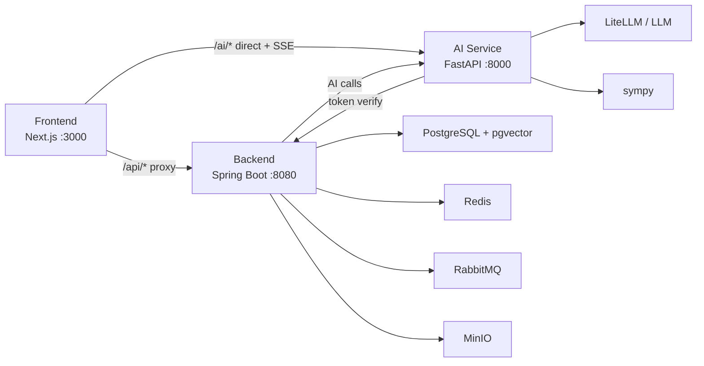

# 系统架构与接口契约

## 总体架构



## 服务职责

| 子系统 | 职责 |
|--------|------|
| Frontend | 页面交互、登录态、API 调用、SSE 展示、图表和表单 |
| Backend | 用户、家族、题库、测试记录、错题记录、会话、权限、持久化 |
| AI Service | 讲题、批改、出题、数学验证、BKT 计算、LLM 调用 |

关键原则：

- Java 是业务数据权威源。
- Python 是 AI 推理和 BKT 计算权威源。
- 前端只展示和提交，不直接决定用户身份或权限。

## 认证与路由

| 路由 | 目标 |
|------|------|
| `/api/*` | Next.js 代理到 Java 后端 |
| `/ai/*` | 前端直连 Python AI 服务 |
| `Authorization` | Sa-Token token，前端保存在 localStorage |

Python AI 服务验证 token 时调用 Java `/api/users/me`。开发期可 fail-open，公网 Beta 需要显式配置策略。

## 核心数据流

### 登录

```text
Frontend -> Backend /api/users/login
Backend -> Sa-Token
Frontend <- token + user
Frontend -> localStorage
```

### 数学诊断

```text
Frontend -> Backend 抽题
Frontend -> AI Service 批改
Frontend -> Backend 提交测试结果
Backend -> 保存 test_records
Backend -> 保存 wrong_question_records
Backend -> AI Service 更新 BKT
Frontend -> 展示测试结果、错题、学力
```

### AI 讲题

```text
Frontend -> AI Service /ai/tutor/explain
AI Service -> LLM
AI Service -> SSE chunks
Frontend -> 流式展示
```

## 主要后端接口

| 能力 | 接口 |
|------|------|
| 当前用户 | `GET /api/users/me` |
| 登录 | `POST /api/users/login` |
| 注册 | `POST /api/users/register` |
| 题库分页 | `GET /api/questions` |
| 题目详情 | `GET /api/questions/{id}` |
| 抽题 | `POST /api/questions/select` |
| 自适应抽题 | `POST /api/questions/adaptive-select/me` |
| 错题 | `GET /api/questions/wrong/me` |
| 测试历史 | `GET /api/assessment/history/me` |
| 提交测试 | `POST /api/assessment/tests` |
| 测试详情 | `GET /api/assessment/tests/{id}/detail` |
| 学力档案 | `GET /api/assessment/profiles/me` |
| 最近发展区 | `GET /api/assessment/zpd/me` |

## 主要 AI 接口

| 能力 | 接口 |
|------|------|
| 健康检查 | `GET /ai/health` |
| 讲题 SSE | `POST /ai/tutor/explain` |
| 批改 | `POST /ai/tutor/grade` |
| 快速批改 | `POST /ai/tutor/grade/quick` |
| 出题 | `POST /ai/tutor/generate` |
| 数学验证 | `GET /ai/tutor/math/verify` |
| BKT 更新 | `POST /ai/assessment/bkt/update` |

## 核心表

| 表 | 用途 |
|----|------|
| `users` | 用户 |
| `families` | 家族 |
| `family_members` | 家族成员 |
| `invite_codes` | 邀请码 |
| `knowledge_points` | 知识点 |
| `questions` | 题库 |
| `test_records` | 测试记录 |
| `wrong_question_records` | 正式错题记录 |
| `ability_profiles` | BKT 学力档案 |
| `chat_sessions` | 讲题会话 |
| `tenant_storage_routes` | 未来多租户存储演进 |

## 当前约束

- RabbitMQ 已配置但当前主链路未启用。
- MinIO 已配置但 Phase 1 文件上传不是主目标。
- 题库质量和数量仍是诊断价值的主要瓶颈。
- 前端测试覆盖仍不足。
- 公网 Beta 前需要成本控制、使用日志和隐私提示。
