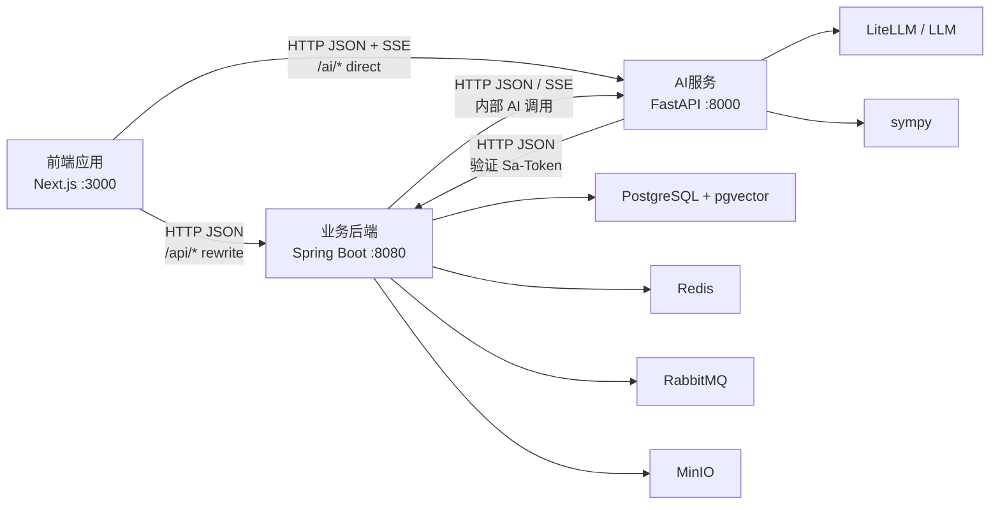

# 系统架构与接口契约

**日期**：2026年6月4日  
**适用范围**：FamilyAgent 全项目  
**目标**：统一项目中的模块、子系统、基础设施组件和 IO 数据格式说法，作为后续开发、联调、测试和 AI Agent 协作的架构参考。

---

## 一、术语说明

FamilyAgent 中容易混淆两类“三大模块”。

### 1.1 产品总目标与三大能力模块

长期产品身份应是 **家族Agent**，而不是单一的 AI家教或 AI助教。家族Agent 是面向整个家庭的智能体体验，负责学习辅导、成长记录、家族知识传承、成员长期记忆和镜像Agent联动。

产品视角的三大模块更准确地说是家族Agent下的三条业务能力线：

| 产品模块 | 英文名 | 目标 |
|----------|--------|------|
| AI家教 / Tutor | Tutor | Phase 1 垂直能力：智能讲题、自适应抽题、智能批改、学力评估 |
| 个性化成长 | Growth | 日记、关键事件、成长仪表盘、技能树、成员成长轨迹 |
| 镜像Agent | Mirror | 长期记忆、人格建模、成员镜像对话、代际传承 |

命名边界：

- 当前代码和 Phase 1 页面仍可使用“AI家教 / Tutor”，因为当前主线是数学学习 MVP。
- 面向用户的长期品牌和总入口应逐步升级为“家族Agent”。
- Tutor、Growth、Mirror 是家族Agent的能力模块，不是彼此割裂的三个产品。
- 家族知识库、对话归档、长期记忆和隐私分层是连接三大能力模块的底层能力。

### 1.2 技术三大子系统

技术视角的三大子系统是运行时服务边界：

| 技术子系统 | 当前实现 | 主要职责 |
|------------|----------|----------|
| 前端应用 | Next.js + React + TypeScript | 页面、交互、状态管理、SSE 展示 |
| 业务后端 | Java + Spring Boot | 用户、家族、题库、测评、会话、数据持久化 |
| AI服务 | Python + FastAPI | 讲题、批改、出题、数学验证、BKT 计算、LLM 调用 |

本文后续所说的“三大技术子系统”，指 **前端应用 / 业务后端 / AI服务**。

---

## 二、总体架构



当前 Phase 1 的主链路：

```text
用户登录
  -> 前端保存 token
  -> 选择题目或生成题目
  -> AI 讲题 / 学生答题
  -> AI 批改
  -> BKT 更新学力
  -> Java 持久化
  -> 前端展示学力评估
```

数据库存储当前采用一个 PostgreSQL 集群承载多租户数据，通过 `family_id`、`user_id`、`visibility` 和 `permission_scope` 做逻辑隔离；未来再按数据量和隐私要求演进到分区、分片或少数独享数据库。详细规划见 `docs/数据库多租户与存储演进规划.md`。

---

## 三、三大技术子系统职责与 IO

### 3.1 前端应用

| 项 | 内容 |
|----|------|
| 技术 | Next.js 16 + React 19 + TypeScript + Zustand + Tailwind CSS |
| 职责 | 页面展示、用户交互、登录态保存、API 调用、SSE 流式渲染 |
| 输入 IO | 用户点击、表单输入、答案输入、路由参数、localStorage token、后端 JSON、AI SSE |
| 输出 IO | HTTP JSON 请求、SSE 请求、页面渲染、localStorage 写入 |

主要数据类型：

```ts
type ChatMessage = {
  id: string;
  role: 'user' | 'assistant' | 'system';
  content: string;
  timestamp: string;
};

type Question = {
  id: number;
  kpId: number;
  subject: string;
  grade: string;
  type: 'CHOICE' | 'FILL' | 'CALCULATION' | 'PROOF';
  difficulty: number;
  content: {
    stem: string;
    options?: string[];
    figures?: string[];
  };
  answer: {
    value: string;
    steps?: string[];
    explanation?: string;
  };
};
```

### 3.2 业务后端

| 项 | 内容 |
|----|------|
| 技术 | Java 17 + Spring Boot 3.3 + MyBatis-Plus + Sa-Token |
| 职责 | 业务规则、鉴权、数据库持久化、题库、学力档案、会话记录、调用 AI 服务 |
| 输入 IO | HTTP JSON、Path 参数、Query 参数、Authorization token、AI 服务 JSON |
| 输出 IO | 统一 `Result<T>` JSON、数据库写入、AI 服务请求 |

统一响应格式：

```json
{
  "code": 200,
  "message": "success",
  "data": {},
  "requestId": "optional",
  "timestamp": 1717480000000
}
```

主要业务数据：

| 数据 | 说明 |
|------|------|
| User | 用户账号、昵称、角色、状态 |
| Family | 家族空间 |
| FamilyMember | 家族成员和角色 |
| KnowledgePoint | 知识点树 |
| Question | 题库题目 |
| TestRecord | 测试记录 |
| AbilityProfile | 学力档案和 BKT 掌握概率 |
| ChatSession | AI 家教会话 |

### 3.3 AI服务

| 项 | 内容 |
|----|------|
| 技术 | Python 3.12 + FastAPI + LiteLLM + sympy |
| 职责 | AI 讲题、智能批改、AI 出题、数学验证、BKT 计算、学习分析 |
| 输入 IO | HTTP JSON、Authorization token、题目文本、学生答案、历史对话、掌握度 |
| 输出 IO | SSE 文本流、HTTP JSON、LLM 结构化 JSON、BKT 结果 |

主要 AI 输入：

```json
{
  "question_content": "题目内容",
  "answer": "标准答案",
  "steps": "标准步骤",
  "student_message": "学生当前问题",
  "history": [
    {"role": "user", "content": "我不会这道题"},
    {"role": "assistant", "content": "我们先看已知条件"}
  ],
  "grade": "初中",
  "subject": "数学",
  "knowledge_point": "一元一次方程",
  "mastery_level": "中"
}
```

主要 AI 输出：

```text
SSE:
data: {"content":"我们先看题目中的已知条件..."}
data: {"content":"你觉得第一步应该做什么？"}
data: {"done":true}
```

---

## 四、子系统间接口契约

### 4.1 前端应用 ↔ 业务后端

| 项 | 说明 |
|----|------|
| 协议 | HTTP REST |
| 数据格式 | JSON |
| 鉴权 | `Authorization: <sa-token>` |
| 路径 | 前端请求 `/api/*`，Next.js rewrite 到 Java `/api/*` |
| 用途 | 用户、家族、题库、测评、会话等业务 API |

典型请求：

```http
POST /api/users/login
Content-Type: application/json
```

```json
{
  "username": "student01",
  "password": "password"
}
```

典型响应：

```json
{
  "code": 200,
  "message": "success",
  "data": {
    "userId": 1,
    "username": "student01",
    "nickname": "学生",
    "token": "sa-token-value",
    "tokenName": "Authorization"
  },
  "timestamp": 1717480000000
}
```

### 4.2 前端应用 ↔ AI服务

| 项 | 说明 |
|----|------|
| 协议 | HTTP REST + SSE |
| 数据格式 | JSON / text-event-stream |
| 鉴权 | `Authorization: <sa-token>` |
| 路径 | 前端直连 `NEXT_PUBLIC_AI_SERVICE_URL/ai/*` |
| 用途 | AI 讲题、批改、出题、数学验证 |

讲题请求：

```http
POST /ai/tutor/explain
Content-Type: application/json;charset=UTF-8
Authorization: <sa-token>
```

```json
{
  "question_content": "解方程 2x + 3 = 7",
  "answer": "x = 2",
  "steps": "2x = 4; x = 2",
  "student_message": "我不知道第一步怎么做",
  "history": [],
  "grade": "初中",
  "subject": "数学",
  "knowledge_point": "一元一次方程",
  "mastery_level": "中"
}
```

讲题响应：

```text
Content-Type: text/event-stream

data: {"content":"我们先观察等式两边，目标是把 x 单独留下。"}

data: {"content":"你觉得第一步应该先处理 +3 还是 2x？"}

data: {"done":true}
```

批改请求：

```json
{
  "question_content": "解方程 2x + 3 = 7",
  "answer": "x = 2",
  "steps": "2x = 4; x = 2",
  "student_answer": "x = 5",
  "subject": "数学",
  "grade": "初中"
}
```

批改响应：

```json
{
  "success": true,
  "data": {
    "overallScore": 40,
    "isCorrect": false,
    "stepGrades": [
      {
        "stepNumber": 1,
        "stepName": "移项",
        "studentWork": "2x = 10",
        "isCorrect": false,
        "score": 0,
        "maxScore": 5,
        "errorType": "移项错误",
        "feedback": "等式两边减 3 后应为 2x = 4。"
      }
    ],
    "errorAnalysis": {
      "primaryErrorType": "移项错误",
      "knowledgeGaps": ["等式性质", "一元一次方程"],
      "suggestion": "复习等式两边同时加减同一个数的规则。"
    },
    "overallFeedback": "思路方向是对的，但移项计算有误。"
  }
}
```

### 4.3 AI服务 ↔ 业务后端

| 项 | 说明 |
|----|------|
| 协议 | HTTP REST |
| 数据格式 | JSON |
| 用途 | AI 服务验证 Sa-Token，获取当前用户信息 |
| 当前策略 | 开发期 fail-open，生产环境应关闭或配置化 |

鉴权请求：

```http
GET /api/users/me
Authorization: <sa-token>
```

鉴权响应：

```json
{
  "code": 200,
  "message": "success",
  "data": {
    "id": 1,
    "username": "student01",
    "nickname": "学生",
    "role": "USER",
    "status": "ACTIVE"
  },
  "timestamp": 1717480000000
}
```

### 4.4 业务后端 ↔ AI服务

| 项 | 说明 |
|----|------|
| 协议 | HTTP REST / SSE 代理 |
| 数据格式 | JSON / text-event-stream |
| 用途 | BKT 更新、AI 批改、AI 出题、讲题代理 |

BKT 更新请求：

```json
{
  "prior_mastery": 0.52,
  "is_correct": true,
  "days_since_last": 2
}
```

BKT 更新响应：

```json
{
  "success": true,
  "prior_mastery": 0.52,
  "is_correct": true,
  "posterior_mastery": 0.8312,
  "mastery_level": "强",
  "delta": 0.3112
}
```

---

## 五、基础设施组件与 IO

### 5.1 PostgreSQL

| 项 | 内容 |
|----|------|
| 类型 | 关系型数据库 |
| 调用方 | 业务后端 |
| 输入 IO | SQL、Java Entity、JSONB、文本、数值、时间 |
| 输出 IO | 表记录、查询列表、分页结果、聚合结果 |
| 当前用途 | 用户、家族、题库、测试记录、学力档案、会话 |
| 未来用途 | 日记、家族知识库、镜像 Agent 数据 |

核心表：

```text
users
families
family_members
knowledge_points
questions
test_records
ability_profiles
chat_sessions
diary_entries
family_knowledge
mirror_agent_data
```

典型 `ability_profiles` 数据：

```json
{
  "user_id": 1,
  "kp_id": 12,
  "mastery_probability": 0.63,
  "total_attempts": 10,
  "correct_attempts": 7,
  "consecutive_correct": 2,
  "last_attempt_at": "2026-06-04T18:00:00"
}
```

### 5.2 pgvector

| 项 | 内容 |
|----|------|
| 类型 | PostgreSQL 向量扩展 |
| 调用方 | 业务后端，未来可能由 AI 服务写入 embedding |
| 输入 IO | embedding 向量 |
| 输出 IO | 相似度检索结果 |
| 当前用途 | 已配置 |
| 未来用途 | 家族知识库 RAG、日记检索、镜像 Agent 长期记忆 |

典型未来数据：

```json
{
  "source_type": "diary_entry",
  "source_id": 1001,
  "content": "今天数学测试又错在方程移项。",
  "embedding": [0.012, -0.118, 0.045]
}
```

### 5.3 Redis

| 项 | 内容 |
|----|------|
| 类型 | 内存缓存 |
| 调用方 | 业务后端 / Sa-Token |
| 输入 IO | key-value、token、session、TTL |
| 输出 IO | 缓存值、登录态、过期判断 |
| 当前用途 | Sa-Token 登录态和会话缓存 |
| 未来用途 | 热点题库、AI 短期上下文、限流、临时学习状态 |

典型数据：

```text
key: satoken:login:token:<token>
value: userId
ttl: token 过期时间
```

### 5.4 RabbitMQ

| 项 | 内容 |
|----|------|
| 类型 | 消息队列 |
| 调用方 | 业务后端 / AI服务 |
| 输入 IO | message JSON、routing key、exchange、queue |
| 输出 IO | 异步任务事件、消费确认、失败重试 |
| 当前用途 | 已配置，Phase 1 基本未启用 |
| 未来用途 | 批量出题、报告生成、语音转写、日记结构化、embedding、镜像记忆更新 |

典型消息：

```json
{
  "eventType": "QUESTION_GENERATE_REQUESTED",
  "requestId": "req_001",
  "userId": 1,
  "subject": "math",
  "grade": "初中",
  "knowledgePoint": "一元一次方程",
  "difficulty": 3,
  "count": 10
}
```

### 5.5 MinIO

| 项 | 内容 |
|----|------|
| 类型 | 对象存储 |
| 调用方 | 业务后端，未来前端通过后端上传 |
| 输入 IO | 文件流、multipart/form-data、object key、metadata |
| 输出 IO | object key、下载 URL、文件流 |
| 当前用途 | 已配置，使用较少 |
| 未来用途 | 头像、题目图片、作业截图、语音日记、知识库附件 |

典型返回：

```json
{
  "objectKey": "uploads/questions/2026/06/question-001.png",
  "url": "http://localhost:9000/fa-bucket/uploads/questions/2026/06/question-001.png",
  "contentType": "image/png",
  "size": 245102
}
```

### 5.6 LiteLLM / LLM

| 项 | 内容 |
|----|------|
| 类型 | LLM 调用适配层 |
| 调用方 | AI服务 |
| 输入 IO | messages JSON、prompt、model、temperature、response schema |
| 输出 IO | 文本、流式文本、结构化 JSON |
| 当前用途 | AI 讲题、批改、出题 |
| 未来用途 | 日记结构化、学习报告、镜像 Agent 对话 |

典型请求：

```json
{
  "model": "deepseek/deepseek-chat",
  "messages": [
    {"role": "system", "content": "你是一位耐心的 AI 家教。"},
    {"role": "user", "content": "请用引导式讲解这道题。"}
  ],
  "temperature": 0.3,
  "max_tokens": 4096
}
```

典型输出：

```json
{
  "content": "我们先看题目中的已知条件，然后一步步把 x 单独留下。"
}
```

### 5.7 sympy

| 项 | 内容 |
|----|------|
| 类型 | Python 数学符号计算库 |
| 调用方 | AI服务 |
| 输入 IO | 数学表达式字符串、标准答案、学生答案 |
| 输出 IO | 化简结果、等价判断、布尔正确性、错误信息 |
| 当前用途 | 数学答案验证、表达式验证、步骤验证 |

典型输入：

```json
{
  "expression": "2*x + 3 = 7",
  "expected": "2",
  "student_answer": "x = 2"
}
```

典型输出：

```json
{
  "is_correct": true,
  "method": "symbolic_equivalence",
  "simplified_expected": "2",
  "simplified_student": "2"
}
```

---

## 六、核心业务数据流

### 6.1 登录鉴权流

```text
前端输入用户名密码
  -> POST /api/users/login
  -> Java 校验密码并创建 Sa-Token
  -> 前端保存 token 到 localStorage
  -> 后续请求带 Authorization header
```

IO 类型：

```text
前端 -> Java: HTTP JSON
Java -> Redis: token/session
Java -> PostgreSQL: 用户查询、最后登录时间更新
Java -> 前端: Result<LoginResponse>
```

### 6.2 AI 讲题流

```text
前端选择题目或输入题目
  -> POST /ai/tutor/explain
  -> Python 验证 token
  -> TutorAgent 调 LLM
  -> Python 通过 SSE 返回讲题分片
  -> 前端逐字追加展示
```

IO 类型：

```text
前端 -> Python: HTTP JSON
Python -> Java: HTTP JSON 验 token
Python -> LLM: messages JSON
Python -> 前端: text/event-stream
```

### 6.3 AI 批改流

```text
学生提交答案
  -> POST /ai/tutor/grade
  -> GraderAgent 调 LLM 和数学验证
  -> 返回结构化评分 JSON
  -> 前端展示评分、错误分析、建议
```

IO 类型：

```text
前端 -> Python: HTTP JSON
Python -> sympy: expression string
Python -> LLM: messages JSON + schema
Python -> 前端: JSON
```

### 6.4 学力评估 / BKT 流

```text
答题结果产生 isCorrect
  -> Java 调 Python /ai/assessment/bkt/update
  -> Python BKT 计算后验掌握概率
  -> Java 持久化 ability_profiles
  -> 前端查询学力档案并展示
```

IO 类型：

```text
Java -> Python: HTTP JSON
Python -> Java: JSON
Java -> PostgreSQL: SQL
前端 -> Java: HTTP JSON
Java -> 前端: Result<List<AbilityProfile>>
```

### 6.5 未来多模态上传流

```text
前端上传题目图片或语音
  -> Java 接收文件
  -> 文件写入 MinIO
  -> Java 保存 object key
  -> AI 服务读取文件或处理转写
  -> 返回识别结果和结构化题目
```

IO 类型：

```text
前端 -> Java: multipart/form-data
Java -> MinIO: object stream
Java -> PostgreSQL: object metadata
Java/Python -> RabbitMQ: async task JSON
Python -> LLM/OCR/ASR: 多模态输入
```

### 6.6 未来长期记忆流

```text
AI家教对话 / 日记 / 学习记录
  -> 提取可记忆信息
  -> 生成 embedding
  -> 写入 PostgreSQL + pgvector
  -> Mirror Agent 检索相关长期记忆
  -> 生成个性化对话或成长分析
```

IO 类型：

```text
业务数据 -> PostgreSQL: structured data
文本内容 -> embedding model: text
embedding -> pgvector: vector
Mirror Agent -> pgvector: similarity search
```

---

## 七、当前约束与注意事项

1. 前端直连 AI 服务是当前设计选择，用于避免 Next.js 代理造成 POST body 或 SSE 流式问题。
2. Java 后端是业务数据和持久化中心，Python AI 服务不应绕过 Java 直接修改核心业务数据。
3. Python AI 服务负责 AI 和算法计算，尤其是 LLM、sympy、BKT。
4. RabbitMQ、MinIO、pgvector 已经配置，但当前 Phase 1 使用较少，主要服务 Phase 2 / Phase 3。
5. AI 服务当前有 fail-open 鉴权策略，适合开发期，生产环境应改为 fail-closed 或通过环境变量显式配置。
6. 数学正确性应尽量使用 sympy 或确定性规则验证，LLM 负责解释和教学，不应作为唯一判题依据。
7. 长期记忆和镜像 Agent 涉及敏感数据，必须有授权、可见性、可解释和删除机制。

---

## 八、推荐文档命名约定

| 文档类型 | 推荐名称 |
|----------|----------|
| 系统交互与 IO 总览 | `系统架构与接口契约.md` |
| 产品能力边界 | `AI家教功能规划.md` |
| 阶段进度 | `进度报告.md` |
| 开发排期 | `项目开发计划书.md` |
| 商业与融资 | `商业计划书.md` |

本文档应随着服务边界、接口、数据模型和基础设施使用方式变化而同步更新。
